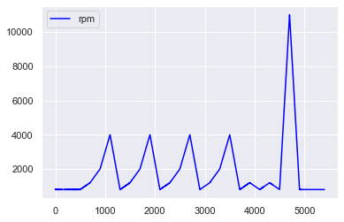
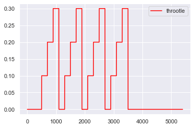
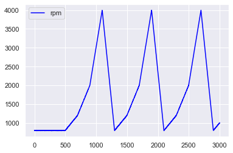
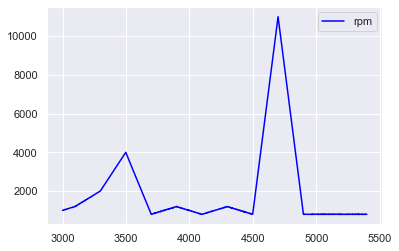
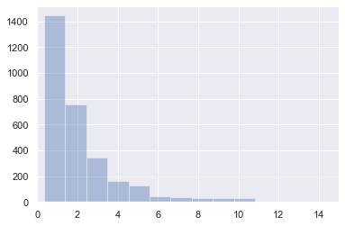
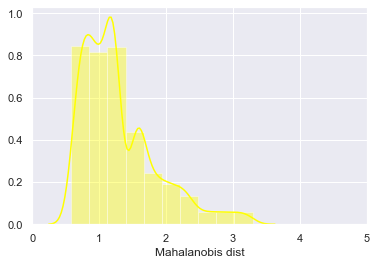
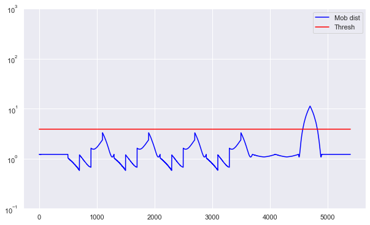

```python
import os
import random
import pandas as pd
import numpy as np
from sklearn import preprocessing
import seaborn as sns
sns.set(color_codes=True)
import matplotlib.pyplot as plt
%matplotlib inline
import random
%run Mahalanobis.ipynb
from sklearn.decomposition import PCA
```


```python
data = pd.read_csv('rpm.csv')
data.columns = ['rpm', 'throotle']
data.head()
```


<div>
<style scoped>
    .dataframe tbody tr th:only-of-type {
        vertical-align: middle;
    }

    .dataframe tbody tr th {
        vertical-align: top;
    }

    .dataframe thead th {
        text-align: right;
    }
</style>
<table border="1" class="dataframe">
  <thead>
    <tr style="text-align: right;">
      <th></th>
      <th>rpm</th>
      <th>throotle</th>
    </tr>
  </thead>
  <tbody>
    <tr>
      <th>0</th>
      <td>805</td>
      <td>0.0</td>
    </tr>
    <tr>
      <th>1</th>
      <td>799</td>
      <td>0.0</td>
    </tr>
    <tr>
      <th>2</th>
      <td>803</td>
      <td>0.0</td>
    </tr>
    <tr>
      <th>3</th>
      <td>800</td>
      <td>0.0</td>
    </tr>
    <tr>
      <th>4</th>
      <td>801</td>
      <td>0.0</td>
    </tr>
  </tbody>
</table>
</div>


```python
scaler = preprocessing.MinMaxScaler()

data_scaler = pd.DataFrame(scaler.fit_transform(data), columns=data.columns, index=data.index)

ax = plt.gca()
data.plot(kind='line',y='rpm',color='blue', ax=ax)
plt.show()
```





```python
ax = plt.gca()
data.plot(kind='line',y='throotle',color='red', ax=ax)
plt.show()
```





```python
dataset_train = data[0:3000]
dataset_test = data[3000:]

ax = plt.gca()
dataset_train.plot(kind='line',y='rpm',color='blue', ax=ax)
plt.show()

ax = plt.gca()
dataset_test.plot(kind='line',y='rpm',color='blue', ax=ax)
plt.show()
```








```python
X_train = pd.DataFrame(scaler.fit_transform(dataset_train), columns=dataset_train.columns, index=dataset_train.index)
X_train.sample(frac=1)
X_test = pd.DataFrame(scaler.transform(dataset_test), columns=dataset_test.columns, index=dataset_test.index)
```


```python
pca = PCA(n_components=2, svd_solver= 'full')
X_train_PCA = pca.fit_transform(X_train)
X_train_PCA = pd.DataFrame(X_train_PCA)
X_train_PCA.index = X_train.index
X_test_PCA = pca.transform(X_test)
X_test_PCA = pd.DataFrame(X_test_PCA)
X_test_PCA.index = X_test.index


data_train = np.array(X_train_PCA.values)
data_test = np.array(X_test_PCA.values)

cov_matrix, inv_cov_matrix  = cov_matrix(data_train)

mean_distr = data_train.mean(axis=0)
dist_test = MahalanobisDist(inv_cov_matrix, mean_distr, data_test, verbose=False)
dist_train = MahalanobisDist(inv_cov_matrix, mean_distr, data_train, verbose=False)
threshold = MD_threshold(dist_train, extreme = True)


plt.figure()
sns.distplot(np.square(dist_train),
             bins = 10, 
             kde= False);
plt.xlim([0.0,15])
```


    (0.0, 15)





```python
plt.figure()
sns.distplot(dist_train,
             bins = 10, 
             kde= True, 
            color = 'yellow');
plt.xlim([0.0,5])
plt.xlabel('Mahalanobis dist')
```


    Text(0.5, 0, 'Mahalanobis dist')





```python
anomaly_train = pd.DataFrame()
anomaly_train['Mob dist']= dist_train
anomaly_train['Thresh'] = threshold
# If Mob dist above threshold: Flag as anomaly
anomaly_train['Anomaly'] = anomaly_train['Mob dist'] > anomaly_train['Thresh']
anomaly_train.index = X_train_PCA.index
anomaly = pd.DataFrame()
anomaly['Mob dist']= dist_test
anomaly['Thresh'] = threshold
# If Mob dist above threshold: Flag as anomaly
anomaly['Anomaly'] = anomaly['Mob dist'] > anomaly['Thresh']
anomaly.index = X_test_PCA.index
anomaly.head()
```


<div>
<style scoped>
    .dataframe tbody tr th:only-of-type {
        vertical-align: middle;
    }

    .dataframe tbody tr th {
        vertical-align: top;
    }

    .dataframe thead th {
        text-align: right;
    }
</style>
<table border="1" class="dataframe">
  <thead>
    <tr style="text-align: right;">
      <th></th>
      <th>Mob dist</th>
      <th>Thresh</th>
      <th>Anomaly</th>
    </tr>
  </thead>
  <tbody>
    <tr>
      <th>3000</th>
      <td>0.805440</td>
      <td>3.88924</td>
      <td>False</td>
    </tr>
    <tr>
      <th>3001</th>
      <td>0.804322</td>
      <td>3.88924</td>
      <td>False</td>
    </tr>
    <tr>
      <th>3002</th>
      <td>0.802088</td>
      <td>3.88924</td>
      <td>False</td>
    </tr>
    <tr>
      <th>3003</th>
      <td>0.799854</td>
      <td>3.88924</td>
      <td>False</td>
    </tr>
    <tr>
      <th>3004</th>
      <td>0.789808</td>
      <td>3.88924</td>
      <td>False</td>
    </tr>
  </tbody>
</table>
</div>


```python
anomaly_alldata = pd.concat([anomaly_train, anomaly])
anomaly_alldata.plot(logy=True, figsize = (10,6), ylim = [1e-1,1e3], color = ['blue','red'])
```


    <matplotlib.axes._subplots.AxesSubplot at 0x247bc5e15c8>




